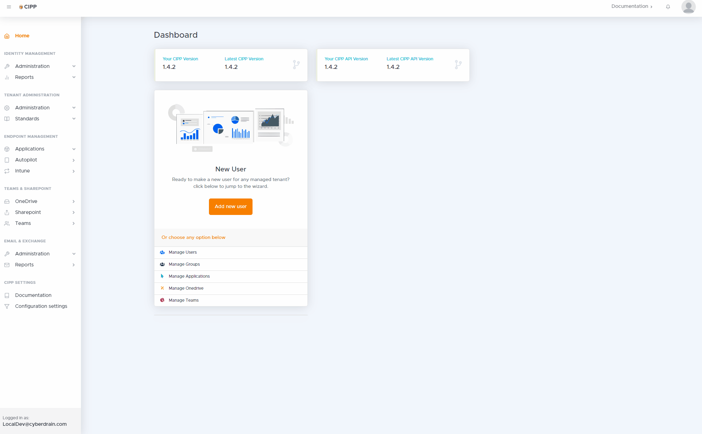
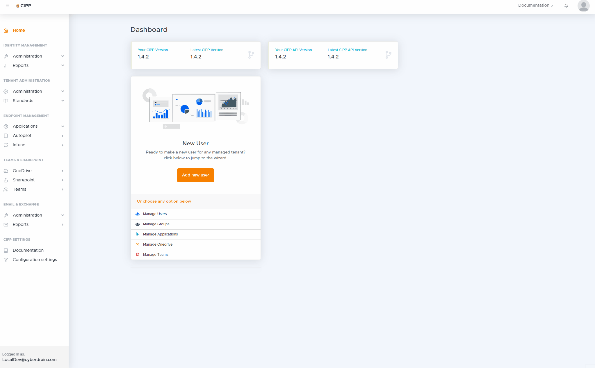
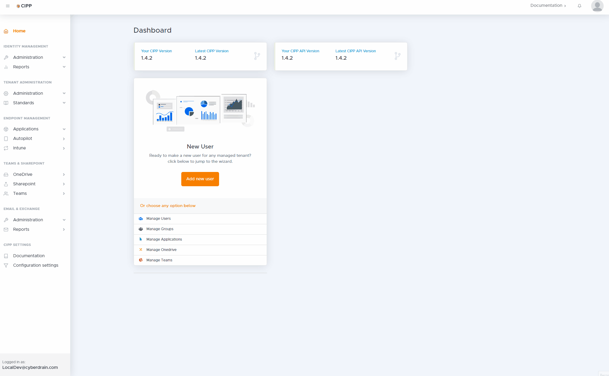

<h1>Sponsored by</h1>

&nbsp;&nbsp;&nbsp;&nbsp;
&nbsp;&nbsp;&nbsp;&nbsp;
&nbsp;&nbsp;&nbsp;&nbsp;

&nbsp;&nbsp;&nbsp;&nbsp;

# What is this?

The CyberDrain Improved Partner Portal is a portal to help manage administration for Microsoft Partners. The current Microsoft partner landscape makes it fairly hard to manage multi tenant situations, with loads of manual work. Microsoft Lighthouse might resolve this in the future but development of this is lagging far behind development of the current market for Microsoft Partners.

This project is a way to help you with administration, with user management, and deploying your own preferred standards. It's not a replacement for security tools, or a way to cut costs on specific subscriptions. The tool should assist you in removing the gripes with standard partner management and save you several hours per engineer per month.

# Deployment and Getting Started

If you want to self-host, check out the installation manual [here](https://cipp.app/GettingStarted/Installation/). You will need some knowledge of Static Web Apps, Azure Functions, and Azure Keyvault

# Why are you making this?

I'm kind of done waiting for vendors to catch up to what we actually need. All RMM vendors are dramaticaly slow adopting cloud management. Microsoft themselves don't understand the Managed services markets, there are vendors that have tried jumping into the gap but either have unreasonable fees, weird constructions, require Global Admins without MFA, or just don't innovate at a pace that is required of cloud services right now.

I'm also annoyed the untransparant behaviour that many companies in our market are showing. Most are claiming that working with the Microsoft Partner APIs is difficult, and requires a very heavy development team. I'm a guy that had no webdesign knowledge before this and created the first release of this app in 3 weekends. Vendors that claim high difficulty or issues with integration are simply not giving this _any_ priority.

I was recently on a call with one of my friends and he said he was changing the world. That insipred me to change the world just a little bit too. :) I'm hoping that this is one of the tools that make you smile.

# What's the pricing?

This project is **FREE** but we do have a **Sponsorware** component. The sponsorware structure for this project is pretty simple; the code is available to everyone and free to use. You will need some technical know-how to put it all together. Sponsors receive the following benefits

### For users of the project that sponsor:

- The project will be hosted for you.
- The hosted version will always be the latest release and automatically updated.
- You'll also receive a staging environment with the latest (nightly/beta) build, to see new features before anyone else.
- You will receive priority on support issues reported on GitHub.
- You will be able to make 1 priortized feature request per month.

Sponsorship allows me to sink some more time into this project and keep it free, so please consider it. :)

### For company sponsors, depending on sponsor level you can get the following benefits;

- Your company logo will be featured on this readme page at the top.
- Your company logo will be featured on https://cyberdrain.com
- A small version of your company logo with a link to your homepage will be on the footer, each user will see this on each page.

# How does it look?!

Check out the GIFs below to see how some of the workflows work.

<kbd></kbd>
<kbd></kbd>
<kbd></kbd>

<kbd></kbd>
<kbd></kbd>
<kbd></kbd>

# What is the functionality?

The current build functionality is described below, also check out our Changelog in the documentation folder, as the tool has a very rapid development schedule the list below might be out of date.

## Identity Management

- Manage M365 users
  - List users, email addreses, and licenses.
  - View & Edit user settings
  - Research if user has been compromised
  - Send user an MFA push to confirm their identity
  - Convert a user to a shared mailbox
  - Block signin, reset passwords
  - Delete users
- Manage M365 groups
  - List all M365 groups, group types, and e-mail addresses.
  - Edit members and group owners
- Offboard users via an easy wizard
  - Remove user licenses
  - Convert user to shared mailbox
  - Disable user sign-in
  - Reset user passord
  - Remove user from all groups
  - Hide user from address list
  - Set Out of Office
  - Give other user access to mailbox, and Onedrive

## Tenants

- Manage M365 tenants
  - List all tenants and quick-links to the most user portals using delegated access.
  - Edit Parter tenant names and default domain for your CSP partner environment
  - List tenant conditional access policies
  - Apply standard configuration to tenant on a repeat schedule.
  - Execute a best practice analyses daily and report on best practice settings
  - Analyse current domains, and domains outside of M365 for optimal security settings
  - List alerts for tenants

## Endpoint Management

- Applications
  - List all applications in tenants
  - List installation status of a specific application per device
  - Add Office Apps to multiple tenants
  - Add/Remove Chocolatey Apps to multiple tenants
  - Assign Apps to All Devices or All Users
  - Report on installation status
- Autopilot
  - Manage and create autopilot devices, profiles, status pages.
- Intune
  - List intune policies
  - Apply Intune Policies
  - Add Intune Policy Templates to deploy over multiple tenants

## Teams & Sharepoint

- List Onedrive, Teams, and Sharepoint usage
- View current teams, installed applications, team owners, members, and channels
- Add and edit teams, members, owners and apps.
- Tenant Alerting

## Exchange

- View mailboxes and contacts
- View user mobile devices
- Convert mailboxes to shared or user mailboxes
- Report mailbox statistics, client acces settings
- Perform message traces
- change and view phishing policies.

## Application settings

- Use multiple user levels(readonly, editor, admin) to manage access
- allow excluding of tenants
- send automated alert emails to webhook or e-mail

# Security

Authentication is handled by Azure AD using static web apps security. This means the API is only reachable for authenticated users you've invited. For most of the security info related to that check out our staticwebapp.config.json and/or the doc pages on static web apps. Do you see something that might be a security risk, even the smallest? report it and we will handle it asap. Check out our security reporting options [here](https://github.com/KelvinTegelaar/CIPP/security)

# Contributions

Feel free to send pull requests or fill out issues when you encounter them, sponsors get a priority on issues and bugs. I'm also completely open to adding direct maintainers/contributors and working together.

If you decide to contribute; remember that keeping the portal fast is a key component. CIPP is supposed to go brrrrr, any improvements that help with speed are welcomed.

## Special thanks

I'd like to give special thanks to the people that made this project possible;

- [Kyle Hanslovan](https://huntress.com)
- [Ray Orsini](https://oit.co)
- The Team at [MSP.zone/MSP'R'Us](https://msp.zone)
- Gavin Stone at [MSPGeek](https://mspgeek.org)
- MSP2.0 for helping with some visual input.
- Scott, Chris, Jon, and others that helped me with some of the internals of the app.
